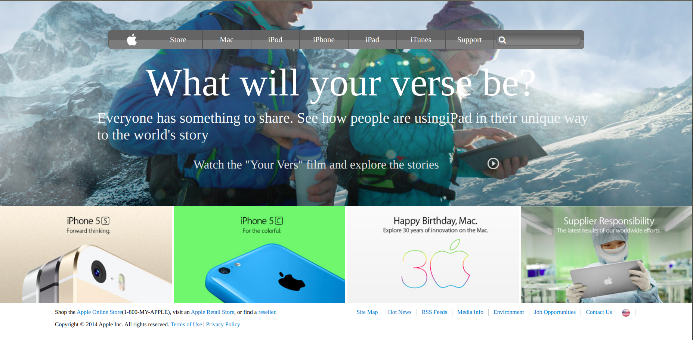

<!-- PROJECT LOGO -->

 

   <h3 align="center">Apple Page</h3>

  

    A simple clone of the Apple Page.
         
     
    ·
     <a href="https://rawcdn.githack.com/WCanirinka/Apple-page/7fdbb68d6f2739d76ca982219ab01f428b7280c5/index.html">View Demo</a>
    ·    
  

<!-- TABLE OF CONTENTS -->
## Table of Contents

* [About the Project](#about-the-project)
  * [Built With](#built-with)
* [Contact](#contact)
* [Acknowledgements](#acknowledgements)

<!-- ABOUT THE PROJECT -->
## About The Project

  I am Wilfried Canirinka. I am part of the Microverse Project and I did this page according to the required specifications.  

### Build With

* [Html]()
* [CSS]()
* [VSCODE]()

### Contact
* Wilfried - [@WCanirinka](https://twitter.com/WCanirinka)  - [LinkedIn](https://www.linkedin.com/in/wilfried-canirinka-884ab0b6/) - [GitHub](https://github.com/WCanirinka)
* Project Link [https://github.com/genzaraki/new-york-times-article-page](https://wcanirinka.github.io/Apple-page/)

### Acknowledgements

* [GitHub](https://github.com)
* [VSCODE]()
* [StyleLint]()
* [Stickler]()
